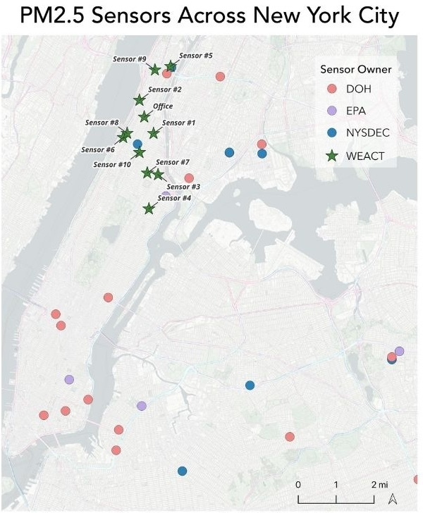

We analyzed data from WE ACT's Community Air Monitoring Project (CAMP) to identify discrepancies in air quality across Manhattan, and to evaluate the short-run effects of the congestion pricing policy, implemented in 2025. 

## Background

Northern Manhattan, home to neighborhoods like Harlem and Washington Heights, has long faced disproportionately high levels of air pollution due to its proximity to highways, industrial facilities, and bus depots. Elevated ambient concentrations of harmful pollutants like PM2.5 have contributed to significant public health disparities in the region . Despite these risks, most government-funded regulatory PM2.5 air quality monitors are located outside of Northern Manhattan, in wealthier areas like the Lower East Side and Dumbo, leaving critical data gaps in some of the city's most vulnerable communities. 
To help fill this data gap, WE ACT for Environmental Justice launched the Community Air Monitoring Project (CAMP) in 2023, installing low-cost PurpleAir-II sensors at community members’ homes to track PM2.5 levels in real time. With congestion pricing being  implemented in NYC, this data is especially critical for evaluating the impact of shifting traffic patterns on air pollution in the already overburdened communities of Northern Manhattan.
This project analyzes CAMP data to identify temporal trends in PM2.5 concentrations across the study period in addition to the preliminary impacts of congestion pricing on air quality in Northern Manhattan communities.

## Methods 

Raw PM2.5 measurements from the 11 sensors were downloaded by WE ACT from the PurpleAir API over the course of the study period from October 31st, 2023 to March 12th,  2025. Each sensor consists of dual-laser particle counters (PMS-5003), named Channels A & B, that separately measure PM2.5 and can be compared to ensure precision of the measurements. To account for limitations in the PurpleAir sensor technology, a correction factor according to the most current research was applied to the raw measurements (Wallace et al., 2022). Data were averaged into hourly means to standardize for non-uniform collection intervals and cleaned according to the criteria featured in Figure 2 to remove potentially invalid data and allow for robust data analysis. All validation and cleaning measures were applied in R.
R and the RStudio IDE were used to visualize trends in the dataset. Time-series, diurnal, and seasonal patterns were assessed visually through various plots and interpreted for statistical significance. PM2.5 data were log-transformed prior to running statistical analyses to account for skewness in the data distribution.

* Air Quality Indices (AQI) for PM2.5 concentrations were calculated using the con2aqi R package.

* Interrupted Time Series (ITS) and Causal Impact analyses using the Bayesian CausalImpact R package evaluated congestion pricing effects.

* Data were compared with NYCCAS and EPA datasets from the same time frame for validation and further interpretation of congestion pricing data.

