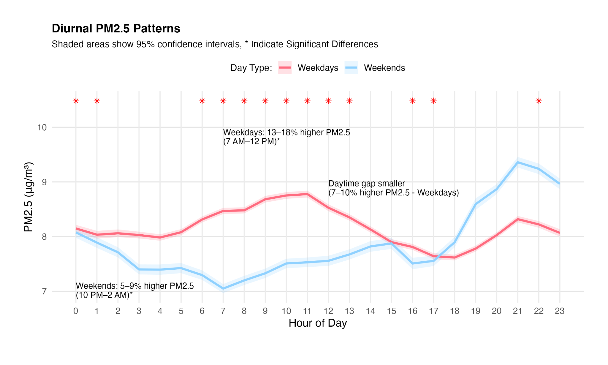
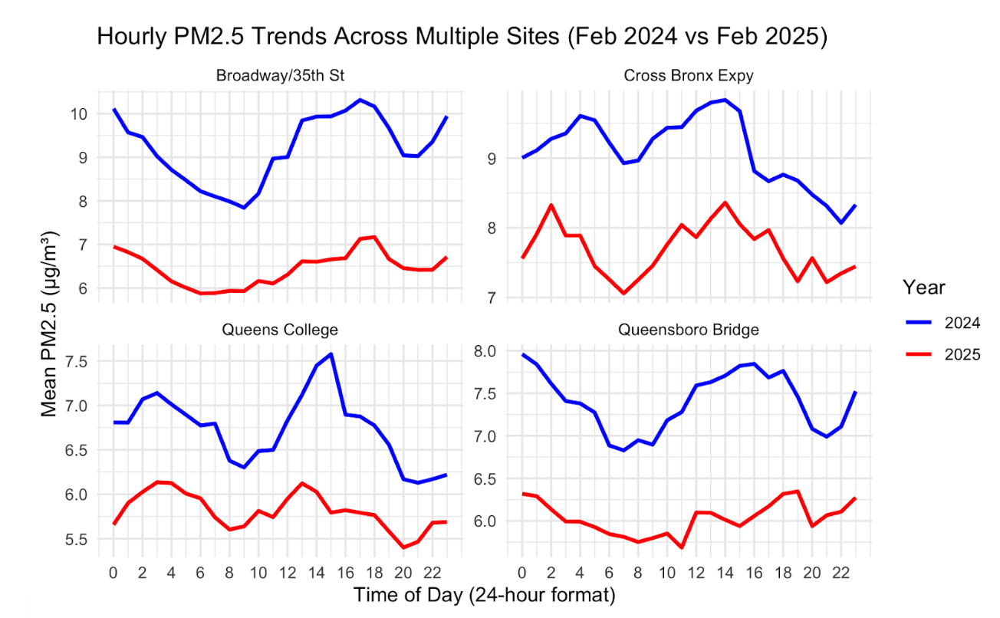

We analyzed data from WE ACT's Community Air Monitoring Project (CAMP) to identify discrepancies in air quality across Manhattan, and to evaluate the short-run effects of the congestion pricing policy, implemented in 2025. 

## Background

Northern Manhattan, home to neighborhoods like Harlem and Washington Heights, has long faced disproportionately high levels of air pollution due to its proximity to highways, industrial facilities, and bus depots. Elevated ambient concentrations of harmful pollutants like PM2.5 have contributed to significant public health disparities in the region . Despite these risks, most government-funded regulatory PM2.5 air quality monitors are located outside of Northern Manhattan, in wealthier areas like the Lower East Side and Dumbo, leaving critical data gaps in some of the city's most vulnerable communities. 
To help fill this data gap, WE ACT for Environmental Justice launched the Community Air Monitoring Project (CAMP) in 2023, installing low-cost PurpleAir-II sensors at community members’ homes to track PM2.5 levels in real time. With congestion pricing being  implemented in NYC, this data is especially critical for evaluating the impact of shifting traffic patterns on air pollution in the already overburdened communities of Northern Manhattan.
This project analyzes CAMP data to identify temporal trends in PM2.5 concentrations across the study period in addition to the preliminary impacts of congestion pricing on air quality in Northern Manhattan communities.

{width=60%}

## Methods 

Raw PM2.5 measurements from the 11 sensors were downloaded by WE ACT from the PurpleAir API over the course of the study period from October 31st, 2023 to March 12th,  2025. Each sensor consists of dual-laser particle counters (PMS-5003), named Channels A & B, that separately measure PM2.5 and can be compared to ensure precision of the measurements. To account for limitations in the PurpleAir sensor technology, a correction factor according to the most current research was applied to the raw measurements (Wallace et al., 2022). Data were averaged into hourly means to standardize for non-uniform collection intervals and cleaned according to the criteria featured in Figure 2 to remove potentially invalid data and allow for robust data analysis. All validation and cleaning measures were applied in R.
R and the RStudio IDE were used to visualize trends in the dataset. Time-series, diurnal, and seasonal patterns were assessed visually through various plots and interpreted for statistical significance. PM2.5 data were log-transformed prior to running statistical analyses to account for skewness in the data distribution.

* Air Quality Indices (AQI) for PM2.5 concentrations were calculated using the con2aqi R package.

* Interrupted Time Series (ITS) and Causal Impact analyses using the Bayesian CausalImpact R package evaluated congestion pricing effects.

* Data were compared with NYCCAS and EPA datasets from the same time frame for validation and further interpretation of congestion pricing data.

##  Results {.tabset}

### Seasonal Trends

{width=60%}
 
Compared to the reference month of January, PM2.5 levels were significantly higher in June (β = 0.40, p = 0.011), July (β = 0.73, p < 0.001), and August (β = 0.57, p < 0.001).

### Diurnal Trends

{width=60%}
 
Weekdays have statistically significantly higher levels of PM2.5 than weekends between the hours of 7-11am, peaking at 9am (p < 0.0001), and from 4-5pm (p < 0.0197). Weekends have statistically significantly higher levels of PM2.5 from 10pm-1am, peaking at midnight (p=0.0020)

###  Congestion Policy Analysis {.tabset}
 
Results of an independent t-test showed a statistically significant reduction between PM2.5  levels in the first two months of 2024 and the first two months of 2025 (t = -33.12, df = 16,125, p < 2.2e-16), with mean log PM2.5 values decreasing from 2.0139 (2024) to 1.8034 (2025). The 95% confidence interval (-0.223, -0.198) confirms a real difference, indicating that PM2.5 levels significantly dropped post-policy. The sites in the Central Business District (CBD) were selected based on highest traffic volume while CAMP sensors were selected based on data availability.

#### NYCCAS Data 
{width=60%}

#### CAMP Data 
{width=60%}
 
 

## Implications 
 
The impact of congestion pricing extended beyond the Central Business District (CBD), with significant PM2.5 reductions across the city. This finding mitigates early concerns about traffic being diverted to outer boroughs. Instead, disparities emerge in the amount of air quality improvement received. PurpleAir data revealed smaller effect sizes in Northern Manhattan compared to citywide NYCCAS monitors, suggesting that local pollution sources may dilute policy benefits.  Additionally, uneven monitor distribution across the city may contribute to data variability. Comparisons with NYCCAS and EPA monitors revealed that regulatory sensors may underestimate exposure in underserved neighborhoods due to sparse coverage. Our hyper-local data provided a more nuanced view, reinforcing the importance of community-based monitoring. While initial congestion pricing impact appears promising, longer-term tracking is essential to achieve equity of air quality improvements.

## Recommendations 
1. Strengthen data collection through citizen science by enabling NYC residents and communities to collect high-frequency, hyper-local and robust data. This will help to fill data gaps in environmental justice (EJ) communities where there is a lack of regulatory air quality monitors.
 
2. Improve funding for Community-Based Participatory Research (CBPR) which equips residents to not only articulate their lived experiences, but also to empirically validate their experiences using data, paving a path for grassroots advocacy. 
 
3. Expand and adopt contextually relevant environmental health policies such as congestion pricing. Our analysis shows the promising impact of congestion pricing in the short-run. Such gains can be maximized through more innovative policy measures with EJ communities in mind. 

